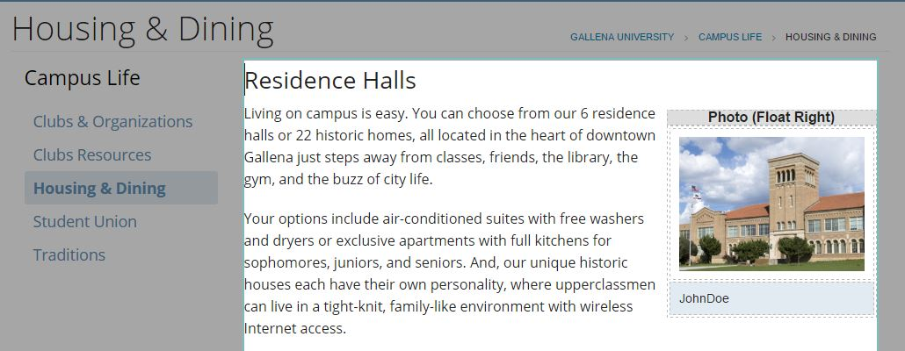
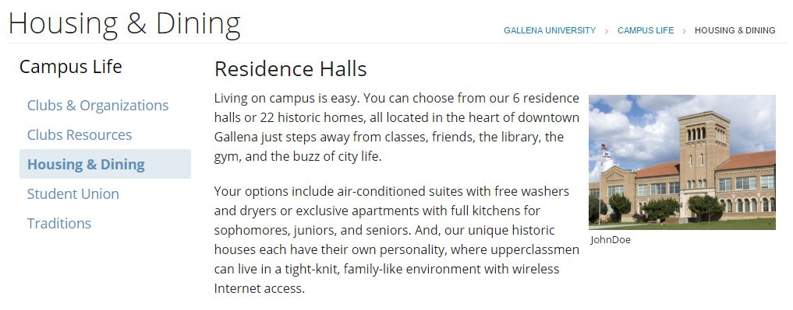

# Floats an image to the right on live &amp; edit mode

## Overview

There are CSS styles for both the editor and published views, so the CSS should be merged accordingly to your existing files. The caption area will not be displayed on publish if empty or removed. The image will include any other elements within the image table cell (if linked, alt tags, etc.) 

Responsive: on mobile devices images will be centered horizontally

## Example

## Output

